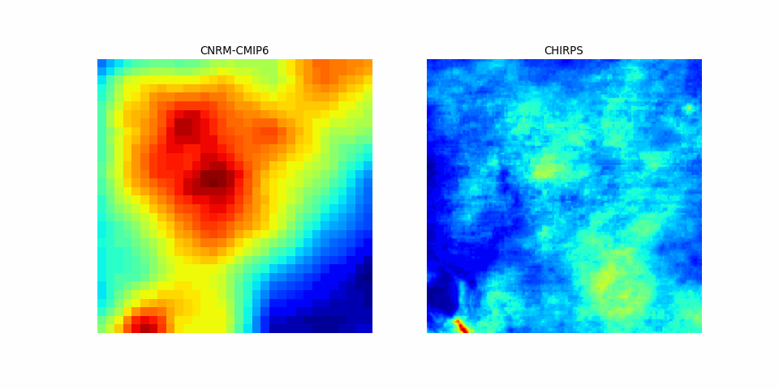

# Spatial Downscaling

This repository contains the data and code related to the downscaling process of CNRM-CMIP6 model data to CHIRPS. Additionally, an animated GIF showcasing the results of the process is included.

# Project Description

The aim of this project is to perform the downscaling of CNRM-CMIP6 model data to the CHIRPS dataset. CHIRPS is a high-resolution precipitation dataset that combines satellite observations and ground station measurements to provide global-scale precipitation estimates.

The downscaling process involves adjusting the spatial and temporal resolutions of the CNRM-CMIP6 data to match the spatial and temporal resolution of CHIRPS. This allows for a more detailed and accurate estimation of precipitation.

